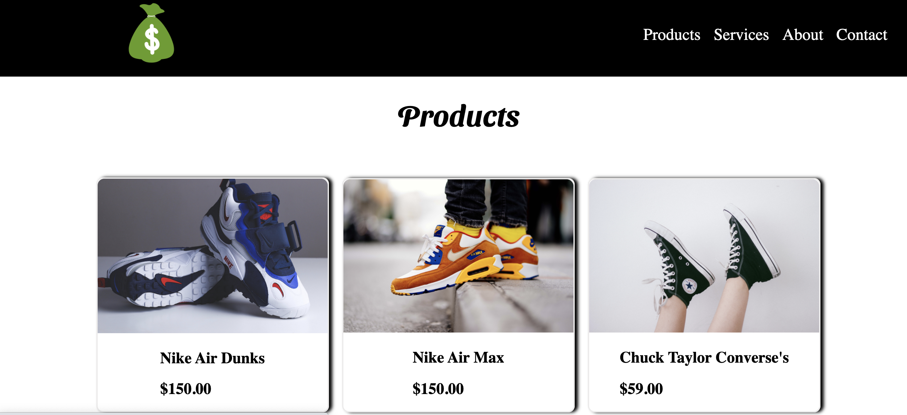
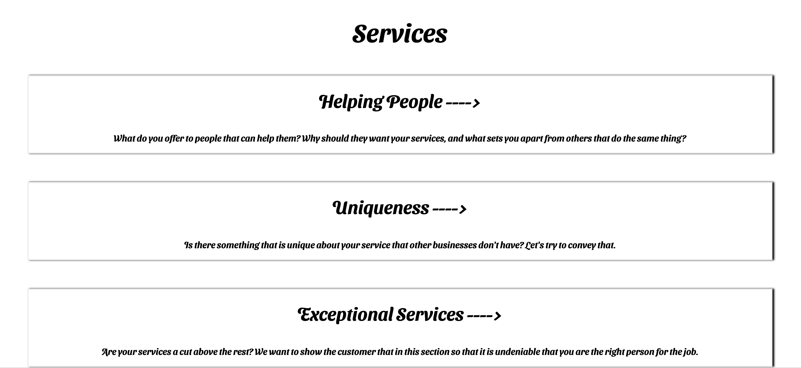
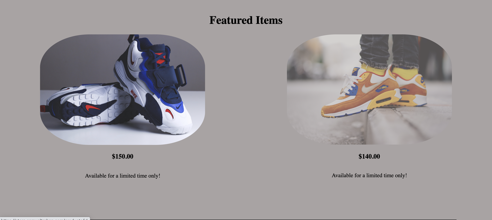

# React Store

[My LinkedIn](https://www.linkedin.com/in/samueltrahan/)

<br/>

[](https://store.samueltrahan.com)

# Description 

React Store is a e-commerce template site for personal or business use.  I wanted to show case different options and services that are available when using React Store such as Products and Services. 

# Screenshots





# Getting Started

If you want to use this template your website

#### 1. Clone this repository to your local machine.

```
git clone https://github.com/samueltrahan/store.rt.git

```
#### 2. Navigate into the repository and install node modules.

```
cd store.rt
yarn 

```
